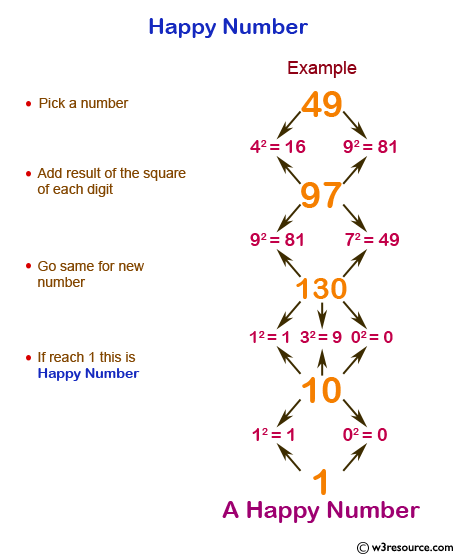

# Happy Numbers

Os números felizes são definidos pelo seguinte procedimento. Começando com qualquer número inteiro positivo, o número é substituído pela soma dos quadrados dos seus dígitos, e repetir o processo até que o número seja igual a 1 ou até que ele entre num ciclo infinito que não inclui um ou seja a soma dos quadrados dos algarismos do quadrado de um número positivo inicial.

Os números no fim do processo de extremidade com 1, são conhecidos como números feliz, mas aqueles que não terminam com um 1 são números chamados infelizes.



# Exemplos

7 é um número feliz, pois:
```
7² = 49
4² + 9² = 97
9² + 7² = 130
1² + 3² + 0² = 10
1² + 0² = 1.
```

4 não é um número feliz, pois:
```
4² = 16
1² + 6² = 1 + 36 = 37
3² + 7² = 9 + 49 = 58
5² + 8² = 25 + 64 = 89
8² + 9² = 64 + 81 = 145
1² + 4² + 5² = 1 + 16 + 25 = 42
4² + 2² = 16 + 4 = 20
2² + 0² = 4 + 0 = 4
```

Os números felizes entre 1 e 500 são:
```
1, 7, 10, 13, 19, 23, 28, 31, 32, 44, 49, 68, 70, 79, 82, 86, 91, 94, 97, 100, 103, 109, 129, 130, 133, 139, 167, 176, 188, 190, 192, 193, 203, 208, 219, 226, 230, 236, 239, 262, 263, 280, 291, 293, 301, 302, 310, 313, 319, 320, 326, 329, 331, 338, 356, 362, 365, 367, 368, 376, 379, 383, 386, 391, 392, 397, 404, 409, 440, 446, 464, 469, 478, 487, 490 e 496
```

# Dicas para manter a sanidade mental

- Comecem com números pequenos onde a gente consiga fazer o cálculo na mão se precisar;
- Vamos por favor trabalhar com faixas abaixo de 500, pois só temos os felizes entre 1 e 500;
- Sempre, sempre, sempre criem o teste primeiro e façam o procedimento da forma "baby step";
- Vamos tentar tomar cuidado com o "entre num ciclo infinito" citado pelo wikipédia, se chegarmos a este ponto vamos definir um limite de iterações, achou o número beleza, não achou beleza também (pra não complicar muito).

# Referências

- [Número feliz - Wikipédia](https://pt.wikipedia.org/wiki/Número_feliz)
- [Números Felizes](http://www.profcardy.com/dicionario/matepedia.php?rg=36)
- [Dojo Gameplay - Happy Numbers](https://www.youtube.com/watch?v=9gokU36gZTY)
