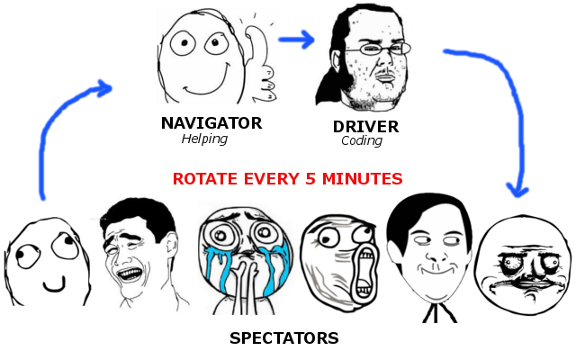
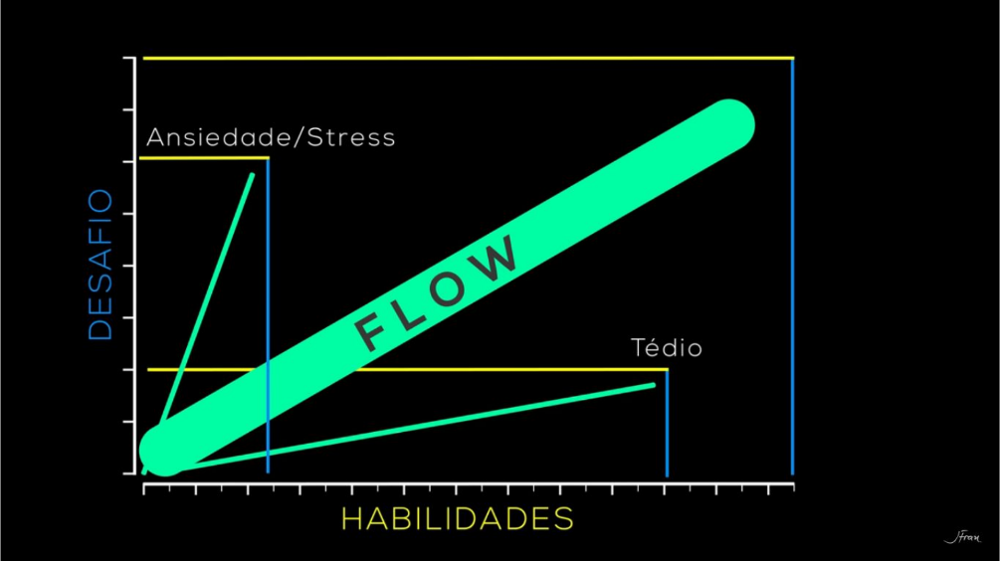

# Coding Dojo Sorocaba

## O que é um Coding Dojo?

Coding dojo é uma dinâmica realizada com pessoas (+ de uma) onde basicamente precisamos de um computador (e talvez um datashow opcionalmente) e um problema para ser "resolvido com código".

## Como é o processo durante um Coding Dojo?

Durante o dojo sempre existirão 2 pessoas "pilotando o código", a primeira pessoa é chamada de piloto e a segunda pessoa é chamada de co-piloto, onde:

- O papel do piloto é codificar a solução do problema (preferencialmente utilizando TDD);
- O papel do co-piloto é ajudar o piloto a codificar porém sem pilotar (sem por a mão no teclado propriamente).

Os papéis de piloto e co-piloto são temporários e trocam em um intervalo de 5 minutos (este tempo pode ser maior ou menor dependendo do dojo). Ao se passarem 5 minutos com o piloto codificando a solução para o problema algumas coisas acontecem:

1. O piloto para de codificar;
2. A platéia opina e discute sobre o código criado nesta iteração;
3. O piloto sai do teclado e volta para o grupo que está assistindo ao dojo;
4. O co-piloto assume a posição do piloto (com a mão no teclado);
5. Uma nova pessoa da platéia assume a posição de co-piloto.

A cada troca entre piloto/co-piloto uma nova pessoa do grupo assume a posição de co-piloto, criando-se assim uma nova formação de piloto/co-piloto.

## Dicas para um bom Coding Dojo

- O enunciado do problema deve estar escrito da forma mais clara possível para facilitar a comunicação com o grupo que irá participar do dojo;
- O problema/enunciado tem que tem um bom "flow";
    - [Flow - Estado de Fluxo - Mihaly Csikszentmihalyi -TED](https://www.youtube.com/watch?v=BAljbVf-HXA);
    - [Python e Flow](https://github.com/dunossauro/slides/blob/master/Python%20e%20Flow.pdf).
   

- É importante ter um slot de tempo para começar e terminar o dojo, e sua resolução não é tão importante para o processo mas sim o aprendizado adquirido durante a dinâmica;
- É legal que um mesmo código (já começado) não volte para o próxima sessão de Dojo, pois isso atrapalha a entrada de pessoas novas nas sessões. Exemplo (que aprendemos em dojos passados): Uma pessoa deixou de ir no dia 10/08 e foi no dia 15/08, quando ela chegar lá no dia 15/08 ela não vai entender nada sobre o código que está sendo feito;
- Adicionar casos de teste (principalmente em problemas mais complexos) e seus resultados no enunciado ajuda a validar se o funcionamento está de acordo com o esperado e economiza tempo durante o Dojo;
- Limitar o escopo do enunciado, pois caso isso não seja feito podemos prolongar e otimizar MUITO uma solução.
